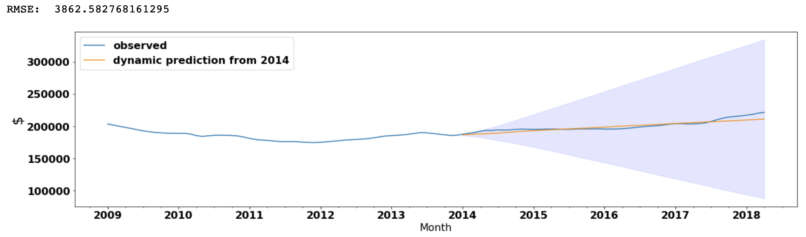

# Module 4 -  Final Project

* Student name: **Dennis Trimarchi**
* Student pace: **Full time**
* Instructor name: **Rafael Carrasco**
* Blog post URL: [https://medium.com/@dtuk81/predicting-average-home-prices-using-time-series-analysis-seasonal-arima-modeling-bcd14990d3f3?sk=3bf3000b26d67a5a5324a12aabee136c]

# Outline

This readme contains sections that summarize the work completed for a time-series data analysis which includes:
* Abstract
* Results Summary & Recommendation
* Exploratory Data Analysis
* Model Selection
* Forecasting & Results Details
* WV Statewide addendum

**All of my Python work is completed in the following files**:
* **[Mod_4_project.ipynb](Mod_4_project.ipynb)** - A jupyter notebook containing the step-by-step workthrough of my time series analysis.
* **[flatiron_time_series.py](flatiron_time_series.py)** - A python file containing functions used in my project notebook.
* **[WV_all_notebook.ipynb](WV_all_notebook.ipynb)** - A jupyter notebook containing time series analysis for the WV Statewide addendum.

-------

Abstract

    
# Abstract

This notebook contains an analysis of home sales price data broken down by zipcode for the Eastern Panhandle region of the great state of West Virginina. The WV panhandle itself contains three counties but the area of analysis includes neighboring counties in Virginia and Maryland. The data used in this project comes from Zillow.

I used a Seasonal ARIMA model to fit the data and make forecasts.

In addition to looking at the Panhandle Region, I have provided a quick statewide summary for West Virginia by metro area as an addendum (because I found it interesting).

#### Primary Region Investigated

The region that was investigated is highlighted in blue in the map below. This represents the eastern panhandle region of West Virginia. This region contains 30 unique zipcodes in the Zillow dataset. Some regions, particularly to the west side of the panhandle region, are very rural and did not contain any records in the Zillow data. 

#### Best Investment Definition

Best is defined as the **highest Return on Investment (ROI) after a 5-year period**. The 5yr period was chosen as an appropriate amount of time for a rural-area real-estate investment. This analysis only considers property value (no assessment was made pertaining to potential income generated from the property in the form of rent).

-------

Results Summary & Recommendation

## Results Summary

The highest forecasted 5-yr ROI zipcodes are shown below in blue while the lowest forecasted 5-yr ROI zipcodes are shown in red. Details showing forecast charts along with a table summary of ROIs are in the Forecasting and Results section.

**Highest projected 5-yr ROI is for zipcode 25404 (Martinsburg, WV) at 29.9%.**

**Lowest projected 5-yr ROI is for zipcode 25442 (Kearneysville, WV) at -0.7%.**

The confidence intervals on the forecasted data are quite large. The **average sale price in the region as of April 2018 was \\$221K forecasted to \\$264K with a confidence interval ranging from \\$125K-\\$404K.** This represents a **5-yr ROI of 19.4%** with best and worse cases being +83% and -43% respectively.

On a state-by-state basis, Maryland came out ahead of both West Virginia and Virginia. Virginia is projected to perform the worst in the region. The zipcodes that have the highest forecasted ROI are mostly clustered along the highway 81 corridor. Highway 81 is the main thoroughfare in the area and easy access to 81 may account for better growth rates. Most regional industry is also located just off of 81. 

### Recommendation
These prospective returns are not very exciting for a real-estate investment company. The best forecast represents a **compound annual growth rate of 5.4%**. Compare this to an investment in one of the many Total Stock indices which are projected to produce compound annual growth rates of over 7% over the next 5-years (and those investments do not require payment of closing costs or property management overhead).

I would not recommend investing in the region for the purposes of maximizing 5-year return as there are other locations in the US which will provide better projections. However, it is important to note that while expected returns are not as high, West Virginia is one of the few states where many regions were unaffected by the 2007 housing market crash. The addendum contains a graphic showing West Virginia housing prices summarized by metropolitan area. There are several areas which were immune to the greater economic forces of the time. In fact, **Fairmont, WV is forecasted to have a 5-yr ROI of 21.5% and it went completely unaffected by the 2007 housing crash**. Depending on an investment firm's needs, this may be a desireable investment if a real-estate bubble is detected.

-------

Exploratory Data Analysis

    
## Exploratory Data Analysis

An initial plot showing the real estate prices for the entire region along with the average for each state's counties in the area are shown below. 

**The 2007 housing bubble crash is easily seen in this chart.** I performed a **Seasonal Decomposition** using  statsmodels *seasonal_decompose* function. The results shows the major trend as seen in the graphic above. There was some very small yearly seasonality.

-------

Model Selection

    
## Model Selection

I performed a training/validation split on my data with August 2017 as the split date. I decided to use all of the data before August 2017 in my model creation despite the presence of the 2007 housing crash. I believe that including this data was appropriate as it represents something that could happen again and should not be ignored. Inclusion of that data resulted in wider confidence intervals on my forecasts.

I used an iterative **"grid search" approach** to choosing my Auto-Regressive and Moving-Average terms. Despite the low seasonality, I decided to use a seasonal model as it would not negatively impact my results. Each model was tested using the **SARIMAX function in the Statsmodels library**. I used model AIC to determine the appropriate model parameters. The grid search approach selected the following terms: **ARIMA(p1,d1,q3)(P0,D1,Q2)12**. 

As p-values are not as important in forecasting, I decided to keep those that had high p-values... deferring to the AIC value as the primary selection criterion. The model summary is provided below:

The one-step-ahead prediction resulted in a Root Mean-Squared error of \\$532 which is fantastic. The dynamic prediction for the region using 2014 as the start date for dynamic predicting also performed quite well with an RMSE of \\$3863. The 5-year forecast follows the general trend of the data leading up to the forecasted region which is appropriate. Plots of the one-step, dynamic, and forecast are provided below.

Satisfied with the results of the model parameters, I used these same p,d,q parameters when creating models for each zipcode in the dataset.

-------

Forecasting Results and Details

    
## Forecasting Results and Details

Each zipcode was modeled using the auto-regressive, differencing, and moving average terms that were decided in the model selection phase. Individual plots for each region with confidence intervals are provided in the mod_4_project jupyter notebook.

### Best zipcodes
The top 5-year ROI zipcodes are shown below:

### Worst zipcodes
The bottom 5-year ROI zipcodes are shown below:

### State comparison
Maryland projected to outperform Virginia and West Virginia in the next 5 years.

-------

WV Statewide addendum

    
## WV Statewide addendum
I decided to do a quick side investigation into the different metro areas (metro areas as denoted by the Zillow data) for the entire state of West Virginia. Surprisingly, a **majority of the state was not impacted by the 2007 housing crisis.** There are only two WV metro areas (Hagerstown and Washington) that show a rise and subsequent fall in sync with the housing bubble crash. Those metro regions (Hagerstown and Washington) are both in the eastern panhandle area and included in the earlier data analysis of this project.

Results of applying the forecasting model to the WV metro area data yielded the following highest 5-year ROI metro areas:

